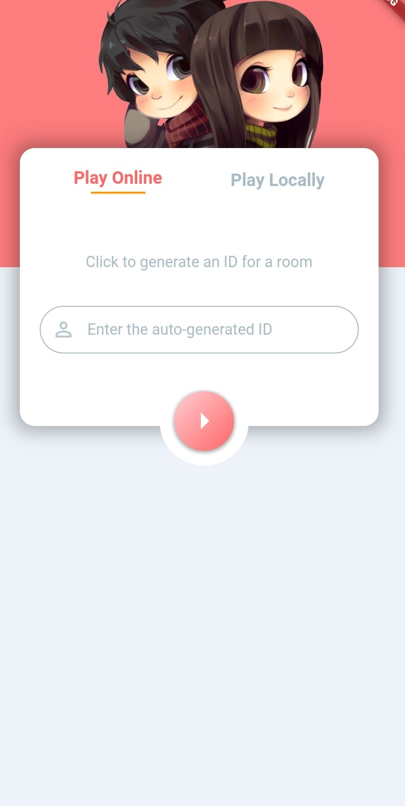

## henshe
is a flutter game based on quizz that targets couples.
# Concept 
it shows the number of questions both partners have to answer to finally calculate the number of similar answers.
# Type of questions :
- Who made the first move?
- Who’s more romantic?
- Who plans more elaborate date nights
- Who’s the best driver?
- Who’s the best chef?
- Who spends more time staring at their phone?
- Who’s more likely to start an argument?
- Who’s more likely to finish an argument?
# The APP

